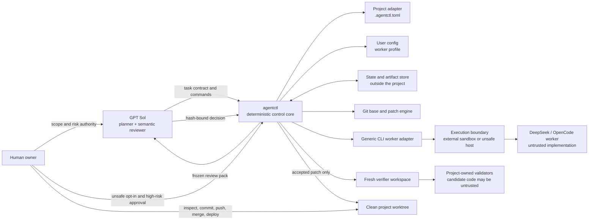
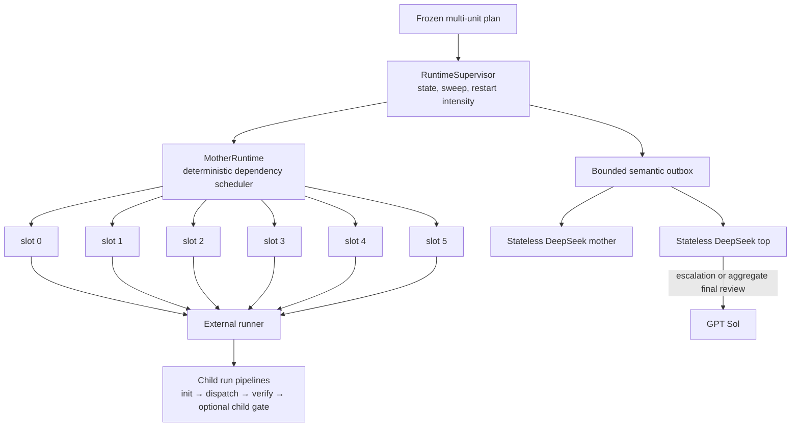
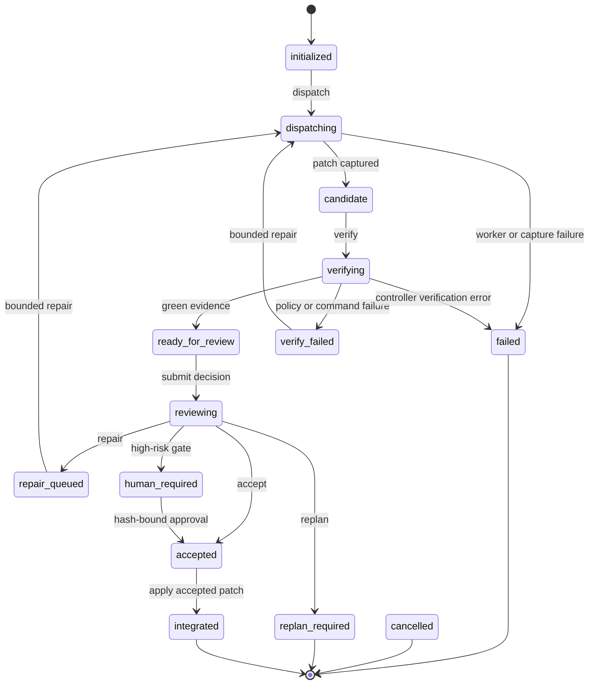

# Ducking Architecture

`ducking` is a reusable control module for supervising lower-cost CLI coding
workers. Its flock metaphor captures the authority model: GPT Sol is the lead
duck that owns planning and final semantic review, while bounded workers follow
the frozen route. The Python `agentctl` core owns deterministic orchestration
and evidence. An attached project supplies policy and validation, while a human
retains unsafe-execution, high-risk, integration, and release authority.

The original single-task run protocol remains the implementation and evidence
pipeline. The OTP-inspired Flock MVP adds a deterministic multi-unit control
layer over it: a `RuntimeSupervisor`, a `MotherRuntime`, exactly six logical duck
slots, lease and EOF records, bounded retry/dead-letter handling, and stateless
semantic routing. It does not turn `agentctl` into a daemon or make six worker
processes appear automatically.

The core design rule is that worker prose is never proof. The controller derives
the candidate from Git, validates it independently, binds every approval to
artifact hashes, and applies only the reviewed patch.

## Components and authority



The responsibilities are deliberately asymmetric:

- **GPT Sol is the control authority for meaning.** It reads project policy,
  creates a bounded task with observable acceptance criteria, chooses validation
  profiles, reviews the frozen patch plus controller evidence, and submits
  `accept`, `repair`, `replan`, or `human_required`. It should invoke the worker
  only through `agentctl`, so the governed workflow does not bypass state or
  evidence. This is an operating rule, not a restriction on a model that has
  otherwise been granted arbitrary host commands.
- **`agentctl` is the control authority for mechanics.** It validates contracts
  and configuration, freezes the base and hashes, creates workspaces, invokes
  argv without a shell, derives the Git patch, applies scope and budget policy,
  runs validators, enforces state transitions, and checks integration
  eligibility. It does not make product judgments.
- **The external CLI worker is untrusted.** It receives a mode-0444 copy of the
  frozen request inside its workspace. Its transcript and claims are retained
  as diagnostics, but the controller reconstructs the candidate from Git and
  does not trust the workspace copy after dispatch. The worker has no protocol
  authority to change the task, approve its patch, or commit, push, merge, or
  deploy the project.
- **The project adapter owns repository-specific policy.** A committed
  `.agentctl.toml` names instruction/context files, protected and high-risk path
  patterns, validation profiles and argv, concurrency, repair, patch, file, and
  changed-line budgets. This is the only project-local integration point.
- **The user config owns provider/runtime wiring.** It lives outside attached
  repositories and maps a semantic profile name to generic CLI argv, probe argv,
  an environment-variable allowlist, runtime identity, output/time limits, and
  an isolation declaration. Provider credentials must not enter task, project,
  or state files.
- **The human owns irreversible and elevated decisions.** The human explicitly
  authorizes `unsafe-host` use, approves hash-bound high-risk changes, and alone
  decides whether to stage, commit, push, merge, or deploy. `agentctl integrate`
  defaults to a check and, when explicitly applied, only modifies the clean
  worktree.

## OTP-inspired Flock MVP

Flock borrows supervision concepts from Erlang/OTP without claiming to be an
OTP runtime. The deterministic state machine, not a language-model conversation,
owns scheduling, leases, retries, slot replacement, dependency readiness, and
terminal state. Its top-level Flock plan is contract version 2; nested task
contracts remain version 1.

The mapping follows the official distinction between a supervisor that owns
child lifecycle and a stateful server/coordinator that handles messages:
[Erlang supervision principles](https://www.erlang.org/doc/system/sup_princ.html),
[Elixir Supervisor](https://hexdocs.pm/elixir/Supervisor.html), and
[Elixir GenServer](https://hexdocs.pm/elixir/GenServer.html). Temporary external
model calls are analogous to supervised tasks, not permanent supervisors; see
[Elixir Task.Supervisor](https://hexdocs.pm/elixir/Task.Supervisor.html).



### RuntimeSupervisor, MotherRuntime, and six fixed slots

- **`RuntimeSupervisor` is deterministic mechanics.** It initializes and
  persists the flock, owns the coordinator epoch, sweeps stale leases, records
  alerts and restart intensity, and terminates or escalates the flock according
  to protocol state. It is represented by controller code and durable state;
  it is not a long-lived model session.
- **`MotherRuntime` is the deterministic scheduler.** On `flock tick`, it finds
  dependency-ready tasks and pairs them with idle slots in stable plan/slot
  order. It issues a lease containing the task and contract hash, attempt,
  coordinator epoch, slot ID, duck incarnation, and a logical branch reference.
  It makes no semantic product decisions.
- **The pool always has six logical slots, numbered 0 through 5.** Plans neither
  resize the pool nor name providers. A flock with fewer ready units simply has
  idle slots; more work waits for dependency readiness and slot availability.
  Six leases are a logical ceiling, not a guarantee of six simultaneous
  processes: the external runner, sandbox capacity, and each child run's
  project `max_parallel` policy can reduce physical concurrency.
- **Retryable leaf replacement is one-for-one.** A recycled or retryable
  failed/expired attempt below the restart circuit releases only its owning
  slot, increments that slot's incarnation, and leaves healthy sibling leases
  running. Cancellation terminates only that task and releases its slot; it is
  not a retry. Successful completion releases the slot without changing its
  incarnation. Fatal/exhausted/dead-letter and circuit escalation are aggregate
  failures: they fence every live sibling lease and give every unfinished task
  a terminal EOF. Lease validation binds the lease ID, coordinator epoch, slot,
  and incarnation, so output from an older occupant is rejected as stale.

Root recovery is a separate, explicit case rather than the leaf one-for-one
policy. After an operator has stopped the lost controller processes,
`flock recover --expected-epoch EPOCH --operation-id OPERATION_ID` fences every
active lease as `controller_lost`, increments the coordinator epoch, and
rebuilds the logical six-slot subtree through normal retry. Pending semantic
obligations for unaffected tasks are re-issued with new epoch fences; recovery
in `final_review` is a replay-safe no-op that preserves the handoff. The compare value
rejects recovery against a stale generation, while replaying the same operation
ID returns the recorded result. More than three root recoveries in the default
60-second window opens a root circuit and escalates, draining all live sibling
leases through terminal EOF. The epoch rejects late events from the old root.

This is logical supervision, not process supervision by a resident daemon.
`flock tick` only records leases and returns assignments. An external runner
must consume each assignment, invoke the existing child `run init` / `unit
dispatch` / `unit verify` pipeline in a suitable isolated execution boundary,
keep the child run store intact until successful EOF validation, emit
heartbeats, and report `flock finish --run CHILD_RUN_ID`. The controller then
retains the verified artifacts for aggregate review. Each assignment embeds
`flock_attempt` in
the returned task. When the leaf pipeline first dispatches it, the controller
materializes `branch_ref` as a local `ducking/...` branch inside that duck's
independent shallow clone. It never creates a branch in the source repository
or shares Git metadata among ducks. `depends_on` only gates when the lease may
be issued; it does not apply an upstream patch to a downstream unit's frozen
base. Until an external assembly/rebase layer exists, dependent units must be
patch-independent or their code handoff must be managed explicitly outside the
MVP.

The optional `flock dashboard` is a loopback-only read/control adapter over the
same durable state. It projects six slots, tasks, lease ages, outbox items,
alerts, and recent events through one-second SSE snapshots. `tick`, `sweep`,
typed-confirmation cancellation, and cost-confirmed Mother/Top dispatch use
same-origin JSON requests plus a random per-process action token. It exposes no
profile argv or credentials and does not become a child-process runner.

Assignment delivery is replay-safe rather than fire-and-forget. A new lease has
`assignment_acknowledged: false`; repeated `flock tick` calls return that same
lease with `replayed: true` until its first valid heartbeat. The external runner
must durably map lease ID to child run before heartbeating and deduplicate a
replay instead of starting a second child. A heartbeat acknowledges delivery;
it does not prove implementation progress or child success.

### Leases, progress, EOF, retry, and the dead-letter path

A lease starts with separate liveness and progress clocks. Repeating the same
`progress_seq` is a heartbeat and refreshes liveness only; increasing it records
new progress, phase, and a bounded diagnostic summary. The summary remains
untrusted worker prose in runtime state and is deliberately omitted from every
semantic snapshot. `flock sweep` compares both clocks with plan policy:

- a soft liveness or progress expiry marks the task `soft_stalled` and offers a
  bounded mother decision such as `wait`, `recycle`, or `notify_top`;
- a hard expiry synthesizes an attempt EOF with `worker_eof_seen: false`,
  replaces the affected slot incarnation, and enters bounded retry handling;
- a real runner closes an attempt with `flock finish` and one of `succeeded`,
  `retryable_failure`, `fatal_failure`, or `cancelled`. Success requires the
  bound `--run CHILD_RUN_ID`; optional caller-supplied hash references are for
  non-success EOF only;
- every attempt receives an immutable attempt EOF. A terminal task receives one
  task EOF, preventing duplicate terminal completion.

For success, the named child must have green evidence and the exact project,
base, config, task, and `flock_attempt` lease envelope. A low-risk child may be
`ready_for_review` or `accepted`; a high-risk child must reach `accepted` through
its per-child hash-bound human gate. The controller re-hashes task, patch, and
evidence, creates a new Flock-owned review pack from them, and retains those
exact bytes under the flock store. For an accepted child it also validates and
retains the review plus any required high-risk human approval. Only
controller-derived hashes enter EOF. Supplying `--artifact` with success is
rejected; a worker or runner cannot attest its own success digest.

Retries are bounded by `retry.max_attempts` (default 3, maximum 10), the
configured delays (default 5 and 30 seconds), and each unit's cumulative
`budget.wall_seconds` across attempts. Controller loss, hard lease or progress
expiry, spawn failure, transient tool failure, and worker crash are
automatically retry-authorized. An ambiguous retryable failure is routed to the
DeepSeek mother for a bounded `retry_task`, `dead_letter`, or `notify_top`
choice. A fatal failure, exhausted attempts or wall budget, or an explicit
dead-letter choice sets the triggering task to `dead_lettered`, escalates the
flock, fences every active sibling lease, gives each unfinished sibling a
terminal escalated EOF, and notifies the top supervisor. More than six
supervised restarts in the 60-second default window opens the pool circuit and
performs the same aggregate drain before routing the anomaly upward.

### Stateless semantic supervision and Sol's narrow path

`mother` and `top` are semantic roles, but neither owns runtime truth. Both map
through `[semantic_roles]` to frozen provider-neutral worker profiles; the
provided configuration intentionally maps both to a read-only DeepSeek
supervisor. `supervisor dispatch --role mother|top` atomically claims one
pending snapshot, then starts a fresh snapshot-only workspace and model
invocation. A live claim prevents a second dispatcher from issuing the same
model call; an expired claim may be reclaimed, while completion from the old
claim is rejected. No previous conversation, worker transcript, heartbeat
summary, other worker prose, or raw log is supplied. The canonical snapshot is
capped at 16 KiB and contains only bounded controller facts plus command IDs.

Semantic delivery is separately bounded from task retry: at most three model
delivery attempts, with 5- then 30-second backoff. The third failure marks the
outbox item exhausted, escalates the flock, and creates a Sol event. It never
loops indefinitely or silently falls back to another model.

The returned action must bind the snapshot ID and SHA-256 and select exactly one
offered command at the current subject revision. Typical commands are:

- mother: `wait`, `recycle`, `retry_task`, `dead_letter`, `notify_top`, and
  no-op acknowledgements such as `hold`;
- top: `ack`, `escalate_sol`, or `open_final_review` when every unit has
  succeeded and been reported. On ambiguous `retry_wait`, Top/Sol `ack`
  authorizes the next bounded attempt. Top DeepSeek is never offered `abort_flock`;
- Sol escalation: `ack` or `abort_flock`; Sol aggregate final review:
  `approve_flock`, `rework`, or `abort_flock`. Sol is not configured as an
  external semantic worker, so the owning control session inspects the snapshot
  and submits its bound action explicitly.

`approve_flock` is eligible only while the flock is in `final_review`, every
task is succeeded and reported to top, and every retained child artifact still
re-hashes correctly. It moves the aggregate to terminal state `reviewed`, not
`complete`. `reviewed` records aggregate semantic review only: it does not
accept or integrate a child run, create a combined patch, or make deployment
eligible. `rework` or Sol's `abort_flock` moves the flock to escalation.

Normal scheduling, heartbeat processing, lease expiry, automatic retries, and
task routing therefore do not spend Sol tokens. The Codex/Sol control session is
awakened only for a senior escalation or aggregate final review by polling
`supervisor next --role sol`. Sol still reviews authoritative child-run patches
and evidence rather than semantic-supervisor prose.

### Flock command surface

Flock is advanced explicitly by CLI calls; no hidden loop runs between them:

```text
agentctl flock init       --project PROJECT --plan PLAN
                          [--allow-unsafe-worker]
                          [--allow-unsafe-supervisor]
agentctl flock status     --project PROJECT [--flock FLOCK_ID]
agentctl flock tick       --project PROJECT --flock FLOCK_ID
agentctl flock heartbeat  --project PROJECT --flock FLOCK_ID
                          --slot SLOT --lease LEASE_ID
                          --progress-seq N --phase PHASE [--summary TEXT]
agentctl flock finish     --project PROJECT --flock FLOCK_ID
                          --slot SLOT --lease LEASE_ID
                          --outcome succeeded --reason REASON
                          --run CHILD_RUN_ID
agentctl flock sweep      --project PROJECT --flock FLOCK_ID
agentctl flock recover    --project PROJECT --flock FLOCK_ID
                          --expected-epoch EPOCH --operation-id OPERATION_ID
                          [--reason REASON]
agentctl flock dashboard  --project PROJECT --flock FLOCK_ID
                          [--port PORT] [--allow-unsafe-supervisor]
agentctl flock cancel     --project PROJECT --flock FLOCK_ID

agentctl supervisor profiles --project PROJECT --flock FLOCK_ID
agentctl supervisor next     --project PROJECT --flock FLOCK_ID
                             --role mother|top|sol
agentctl supervisor dispatch --project PROJECT --flock FLOCK_ID
                             --role mother|top
                             [--allow-unsafe-supervisor]
agentctl supervisor apply    --project PROJECT --flock FLOCK_ID --file ACTION
```

`supervisor dispatch` executes only the external `mother` and `top` roles. The
`next`/`apply` pair supports explicit inspection or alternate delivery of the
same bound action protocol. `sol` is an inbox role for the owning Codex session,
not a provider profile that this CLI launches.

### Flock security and integrity boundary

Flock preserves the existing least-authority model but adds an external-runner
boundary that operators must account for:

- `flock init` requires a clean project and a plan base equal to current
  `HEAD`; it stores the normalized plan, project-config hash, and frozen hashes
  of the child worker and mother/top profiles under the state home outside the
  project. An `unsafe-host` child profile requires
  `--allow-unsafe-worker`, and any `unsafe-host` semantic profile requires
  `--allow-unsafe-supervisor` at initialization. These do not replace the later
  per-child-run and per-dispatch unsafe gates;
- plans and semantic snapshots contain no credential values or provider CLI
  details. Supervisor environments still use the profile's explicit allowlist
  and log redaction, which are containment aids rather than a secret boundary;
- semantic snapshots exclude prior conversation, transcripts, heartbeat
  summaries, other worker prose, and raw logs. Snapshot hash, claim ID, command
  ID, subject/flock revisions, coordinator epoch, and flock state make actions
  bounded and stale decisions fail closed;
- an `unsafe-host` semantic profile requires the explicit
  `--allow-unsafe-supervisor` dispatch flag. OpenCode's read-only agent policy is
  defense in depth, not OS isolation; use an actual container, VM, or sandbox
  for unattended dispatch;
- a Flock lease is a logical capability checked by the controller, not a
  process sandbox, network lease, or cross-host lock. The external runner and
  every child worker/validator need their own real isolation and credential
  boundary;
- `flock recover` does not kill processes. Its caller must first prove and stop
  the old controller tree, read the current epoch, and pass that value as
  `--expected-epoch` with a stable `--operation-id`. Repeating the same operation
  ID is idempotent; a new recovery against a stale epoch fails closed;
- successful `flock finish --run` trusts neither caller digests nor child state
  labels alone. It revalidates and retains the bound child artifacts before
  recording success. `--artifact` is rejected for a successful EOF.

Here “atomic task” means one indivisible contract. It does not mean creating a
new BEAM atom for every task, branch, model, or lease. If an Elixir/Erlang
adapter is added, dynamic identifiers must stay binaries/tuples or Registry
keys; dynamically created atoms are not garbage-collected, as warned in the
[Elixir String documentation](https://hexdocs.pm/elixir/String.html).

Flock state uses atomic files, a local PID lock, append-only events, hashes, and
bounded payloads. As with single-run state, these detect drift and inconsistent
handoffs but are not signatures and do not defend against a principal able to
rewrite the whole local store.

### MVP boundary: no aggregate patch pipeline yet

For each successful unit, Flock copies the verified child task, patch, and
evidence, creates its own review pack, and records controller-derived hashes in
its state store. An accepted child contributes its validated review and any
required high-risk human approval as additional retained artifacts.
When all tasks succeed and top acknowledges them, it writes an aggregate
manifest over those retained records and exposes the manifest to Sol. It still
does not assemble patches, rebase dependent units, resolve conflicts, create an
aggregate verifier workspace, or produce a combined review pack. Sol may choose
`approve_flock`, `rework`, or `abort_flock`; `approve_flock` verifies the
retained bytes and marks state `reviewed` only. It does not submit child review
decisions or invoke `integrate`. There is no automatic combined patch
application, child integration, commit, push, merge, release, or deploy.

### Illustrative cached-context cost trace

One recorded comparison used 42,650 cache-miss input tokens, 1,133,696
cache-read tokens, and 32,216 output tokens. At the rates assumed for that
trace, the DeepSeek route cost **$0.050690**. Pricing the same token mix as a
Sol counterfactual cost **$1.746578**: $0.213250 miss input, $0.566848 cached
input, and $0.966480 output. That is an illustrative **97.10% saving**:
`1 - 0.050690 / 1.746578`.

The input cache-hit ratio in this trace is **96.37%**:
`1,133,696 / (1,133,696 + 42,650)`. Cache-read tokens are **93.805%** of all
counted tokens when output is included:
`1,133,696 / (42,650 + 1,133,696 + 32,216)`.

This is a single counterfactual example, not a benchmark or guarantee. Provider
prices, cache eligibility/hit rate, token accounting, prompts, routing, and
model quality can change; the unusually high cache share is not guaranteed. A
cheaper semantic route never replaces deterministic verification or Sol's
required final judgment. Recalculate with the current
[GPT-5.6 Sol pricing](https://developers.openai.com/api/docs/models/gpt-5.6-sol)
and [DeepSeek pricing](https://api-docs.deepseek.com/quick_start/pricing/)
before using the example as a budget forecast.

## Single-run execution and data flow

1. `run init` requires a clean project worktree, resolves the task base to the
   exact current `HEAD`, checks that required context is committed, loads the
   selected worker profile, probes its runtime identity, and snapshots the task,
   project-config hash, and worker-profile hash in a new run store.
2. On the first dispatch, the controller initializes an independent Git
   repository, fetches only the exact base commit at depth one, and checks it out
   detached. It does not retain an `origin` remote or unrelated refs and history.
   The worker edits this workspace. A repair dispatch reuses that bounded worker
   workspace so it can correct the current candidate within the remaining repair
   budget.
3. The controller creates a separate shallow metadata workspace that the worker
   never owns. It points that trusted Git directory at the worker's files as an
   external worktree, force-adds untracked paths with intent-to-add, and captures
   `git diff <base_sha>` with external diff and textconv disabled. Worker-local
   `.git` config, index, commits, remotes, and `core.worktree` are therefore not
   part of patch derivation. The byte-bounded patch, changed paths, line count,
   binary-file list, and patch SHA-256 become controller artifacts.
4. Verification first checks patch drift and structural policy. For an eligible
   candidate it creates a new shallow verifier workspace from the same exact
   base, applies the frozen patch, checks that the reproduced hash matches, and
   runs project-owned validation argv there. The worker workspace is never
   accepted as validation evidence.
5. `review pack` combines the immutable task, frozen patch, and deterministic
   evidence for Sol. The review decision must name the same run and bind to the
   task, patch, and evidence hashes. A repair returns bounded findings to the
   next worker request; a replan terminates the run and requires a new task.
6. Integration re-reads the hashed artifacts, requires green evidence and an
   eligible decision, checks a human approval when required, requires project
   `HEAD` to equal the frozen base and the worktree to be clean, then runs
   `git apply --check`. Applying the patch is opt-in and still creates no commit.

## Trust and isolation boundaries

Git clones, path allowlists, protected-path patterns, environment allowlists,
redaction, and post-run diff inspection are useful **detective and containment
controls**. They are not an operating-system sandbox. In particular, a process
running as the host user may still read or mutate files outside its workspace,
use inherited credentials, access the network, or start descendant processes if
the surrounding runtime permits it.

The two supported declarations make that distinction explicit:

- `external-sandbox` means the configured argv enters a real container, VM, or
  OS sandbox before starting the worker or validators. The user owns and tests
  this boundary, including filesystem mounts, network policy, process limits,
  and credential exposure. V0 trusts this declaration; `doctor` can probe the
  executable but cannot prove that the sandbox exists or is correctly configured.
- `unsafe-host` accurately declares direct execution with the host user's
  authority. Run initialization then requires `--allow-unsafe-worker`, and each
  verification requires `--allow-unsafe-validation`. These flags require an
  explicit invocation opt-in; they do not persist an authority artifact, add
  isolation, or belong in unattended automation.

Validators deserve the same treatment as workers because build scripts and
tests can execute candidate code. Worker output is bounded and environment
values explicitly allowed to it are redacted from captured logs, but redaction
is not a credential boundary. The controller state directory is withheld from
the worker request, yet a same-user `unsafe-host` process may still discover it.

The state store itself is trusted local controller storage. Atomic files,
hashes, and append-only event writes detect drift and inconsistent handoffs;
they are not signatures. A principal able to rewrite both state and artifacts
can replace the recorded hashes, so stronger multi-user or remote deployments
need filesystem isolation or a signed/remote evidence store.

## Artifact and hash bindings

Run artifacts live under the XDG state directory (or
`AGENTCTL_STATE_HOME`), namespaced by project ID plus a hash of the resolved
project path. The store contains `state.json`, an fsynced JSONL event log,
frozen contracts, worker requests/results, logs, workspaces, the patch, evidence,
review, and optional human approval. Project attachment receipts live beside the
run namespaces, not in the project.

The binding chain is:

```text
committed base SHA
  + project config SHA-256
  + canonical task SHA-256
  + canonical worker-profile SHA-256
        -> controller-derived patch bytes SHA-256
        -> evidence file SHA-256 (also names the patch hash)
        -> review file SHA-256 (binds run + task + patch + evidence)
        -> optional human approval SHA-256
           (binds run + task + patch + evidence + review)
```

Before each sensitive step, `agentctl` reloads the project config and frozen
artifacts and compares their hashes. It also detects candidate changes between
capture and verification, verifies that a fresh clone reproduces the patch, and
checks the reviewed base and clean worktree immediately before integration.
These bindings prevent accidental or partial artifact substitution within the
controller protocol; they are integrity bindings, not identity signatures or a
defense against compromise of the whole state store.

## Validation coverage and risk routing

Structural policy runs before project commands:

- every changed path must match the task `allowed_paths`, must not match task
  `forbidden_paths` or project `protected_paths`, and must have a selected
  profiled validation command whose path matcher covers it;
- project file-count, changed-line, and patch-byte budgets are enforced;
- binary patches and changed symlinks are rejected;
- a controller-owned `git diff <base_sha> --check` always runs;
- selected project commands run as argv arrays with bounded time and output,
  record exit status, duration, argv, project-supplied environment names, log
  path, and log SHA-256; a nonzero result prevents green evidence;
- after validation, the verifier re-captures the candidate and fails evidence if
  validators changed reviewed files.

Deterministic success is necessary but not sufficient. Sol must independently
map every task acceptance-criterion ID to evidence; an `accept` decision must
cover the criterion set exactly, mark all supplied criteria passed, and contain
no blocker or major finding. Any project `high_risk_paths` match or task
`risk_flags` makes direct acceptance ineligible. Sol must submit
`human_required`, after which the human approval must match the frozen task,
patch, evidence, and review hashes before the run can become accepted.

## Single-run state machine



Cancellation is available from initialized, dispatching, candidate, verifying,
verify-failed, ready-for-review, repair-queued, human-required, and accepted
states. Dispatching and verification use a cancellation request file; other
eligible states transition synchronously. `reviewing` is an internal synchronous
transition during decision submission.

## Failure handling and V0 recovery limits

Worker execution has wall-clock and output budgets, process-group termination,
and a small watchdog that terminates the local worker process group if its
controller pipe disappears. Validation commands have time, output, cancellation,
and process-group termination while the CLI is alive. Run locks and per-project
dispatch slots use PID files and recover a lock when its recorded local process
no longer exists. Repair rounds are capped by the smaller of the task and
project repair limits.

These controls are intentionally local and bounded, not a durable orchestration
service:

- `agentctl` is a synchronous CLI, not a daemon or distributed scheduler;
- validator crash supervision is not a full daemon: a controller or host crash
  can leave a run in `dispatching` or `verifying`, and V0 has no automatic
  reconciliation or resume command;
- the worker watchdog covers its local process group only; it cannot recall work
  that escaped that group or is managed inside an external runtime;
- locks are single-host PID locks. Flock task leases are logical state records,
  not cross-host process leases;
- `failed`, `cancelled`, `replan_required`, and `integrated` are terminal; failed
  infrastructure recovery normally starts a new run from a clean committed base;
- each child run still contains one task unit. Flock can lease units from a
  dependency DAG, but execution requires an external runner; cross-run rollback,
  aggregate patch assembly, automatic rebasing, and automatic
  commit/push/merge/deploy remain out of scope.

Operators should keep the state store until the resulting commit is audited,
inspect a stuck run with `run status`, terminate any proven orphan processes
outside `agentctl` when necessary, and create a new run rather than editing run
state by hand.

## Portability and extension seams

The runtime uses Python 3.11+ standard library and Git, with no Python runtime
dependencies. The launcher and process controls target POSIX environments;
macOS and Linux are the first-class V0 platforms. Process groups, signals,
descriptor polling, and the shell launcher mean native Windows support requires
an alternate process supervisor and launcher.

Reusable seams are intentionally narrow:

- a project attaches through one versioned `.agentctl.toml` and can select any
  repository-owned validator argv and validation profile layout;
- a user can swap DeepSeek/OpenCode for another CLI runtime by changing the
  `generic-cli` worker profile without modifying projects;
- argv placeholders (`workspace`, `request_file`, `events_file`, `run_id`, and
  `prompt`) form the provider-neutral invocation boundary;
- task, review, evidence, event, and project schemas are versioned, and the
  controller rejects unsupported major protocol/controller versions;
- future implementations can add adapter types, verified sandbox providers,
  signed or remote artifact stores, durable recovery, a resident external
  runner, and aggregate patch assembly/verification behind the existing
  task/evidence/review boundary.

The current code accepts only the `generic-cli` adapter and protocol/schema
version 1. Extensions should preserve the central invariant: no worker or
provider becomes the authority for its own scope, evidence, review, or release.
