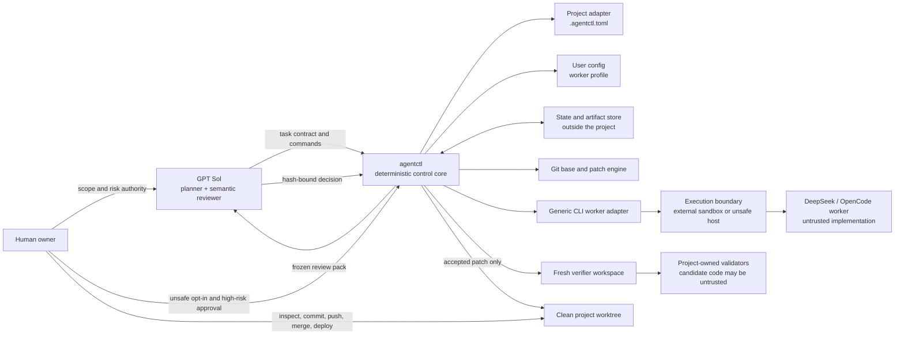
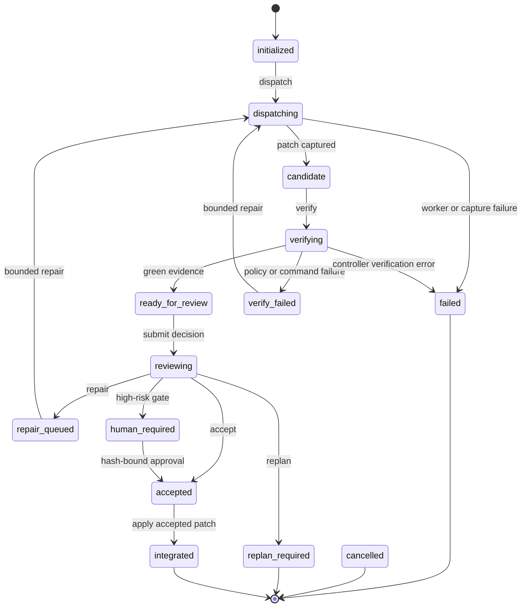

# Agent Control Plane Architecture

`agent-control-plane` is a reusable control module for supervising lower-cost
CLI coding workers. GPT Sol owns planning and semantic review; the Python
`agentctl` core owns deterministic orchestration and evidence. An attached
project supplies policy and validation, while a human retains unsafe-execution,
high-risk, integration, and release authority.

The core design rule is that worker prose is never proof. The controller derives
the candidate from Git, validates it independently, binds every approval to
artifact hashes, and applies only the reviewed patch.

## Components and authority



The responsibilities are deliberately asymmetric:

- **GPT Sol is the control authority for meaning.** It reads project policy,
  creates a bounded task with observable acceptance criteria, chooses validation
  profiles, reviews the frozen patch plus controller evidence, and submits
  `accept`, `repair`, `replan`, or `human_required`. It should invoke the worker
  only through `agentctl`, so the governed workflow does not bypass state or
  evidence. This is an operating rule, not a restriction on a model that has
  otherwise been granted arbitrary host commands.
- **`agentctl` is the control authority for mechanics.** It validates contracts
  and configuration, freezes the base and hashes, creates workspaces, invokes
  argv without a shell, derives the Git patch, applies scope and budget policy,
  runs validators, enforces state transitions, and checks integration
  eligibility. It does not make product judgments.
- **The external CLI worker is untrusted.** It receives a mode-0444 copy of the
  frozen request inside its workspace. Its transcript and claims are retained
  as diagnostics, but the controller reconstructs the candidate from Git and
  does not trust the workspace copy after dispatch. The worker has no protocol
  authority to change the task, approve its patch, or commit, push, merge, or
  deploy the project.
- **The project adapter owns repository-specific policy.** A committed
  `.agentctl.toml` names instruction/context files, protected and high-risk path
  patterns, validation profiles and argv, concurrency, repair, patch, file, and
  changed-line budgets. This is the only project-local integration point.
- **The user config owns provider/runtime wiring.** It lives outside attached
  repositories and maps a semantic profile name to generic CLI argv, probe argv,
  an environment-variable allowlist, runtime identity, output/time limits, and
  an isolation declaration. Provider credentials must not enter task, project,
  or state files.
- **The human owns irreversible and elevated decisions.** The human explicitly
  authorizes `unsafe-host` use, approves hash-bound high-risk changes, and alone
  decides whether to stage, commit, push, merge, or deploy. `agentctl integrate`
  defaults to a check and, when explicitly applied, only modifies the clean
  worktree.

## Execution and data flow

1. `run init` requires a clean project worktree, resolves the task base to the
   exact current `HEAD`, checks that required context is committed, loads the
   selected worker profile, probes its runtime identity, and snapshots the task,
   project-config hash, and worker-profile hash in a new run store.
2. On the first dispatch, the controller initializes an independent Git
   repository, fetches only the exact base commit at depth one, and checks it out
   detached. It does not retain an `origin` remote or unrelated refs and history.
   The worker edits this workspace. A repair dispatch reuses that bounded worker
   workspace so it can correct the current candidate within the remaining repair
   budget.
3. The controller creates a separate shallow metadata workspace that the worker
   never owns. It points that trusted Git directory at the worker's files as an
   external worktree, force-adds untracked paths with intent-to-add, and captures
   `git diff <base_sha>` with external diff and textconv disabled. Worker-local
   `.git` config, index, commits, remotes, and `core.worktree` are therefore not
   part of patch derivation. The byte-bounded patch, changed paths, line count,
   binary-file list, and patch SHA-256 become controller artifacts.
4. Verification first checks patch drift and structural policy. For an eligible
   candidate it creates a new shallow verifier workspace from the same exact
   base, applies the frozen patch, checks that the reproduced hash matches, and
   runs project-owned validation argv there. The worker workspace is never
   accepted as validation evidence.
5. `review pack` combines the immutable task, frozen patch, and deterministic
   evidence for Sol. The review decision must name the same run and bind to the
   task, patch, and evidence hashes. A repair returns bounded findings to the
   next worker request; a replan terminates the run and requires a new task.
6. Integration re-reads the hashed artifacts, requires green evidence and an
   eligible decision, checks a human approval when required, requires project
   `HEAD` to equal the frozen base and the worktree to be clean, then runs
   `git apply --check`. Applying the patch is opt-in and still creates no commit.

## Trust and isolation boundaries

Git clones, path allowlists, protected-path patterns, environment allowlists,
redaction, and post-run diff inspection are useful **detective and containment
controls**. They are not an operating-system sandbox. In particular, a process
running as the host user may still read or mutate files outside its workspace,
use inherited credentials, access the network, or start descendant processes if
the surrounding runtime permits it.

The two supported declarations make that distinction explicit:

- `external-sandbox` means the configured argv enters a real container, VM, or
  OS sandbox before starting the worker or validators. The user owns and tests
  this boundary, including filesystem mounts, network policy, process limits,
  and credential exposure. V0 trusts this declaration; `doctor` can probe the
  executable but cannot prove that the sandbox exists or is correctly configured.
- `unsafe-host` accurately declares direct execution with the host user's
  authority. Run initialization then requires `--allow-unsafe-worker`, and each
  verification requires `--allow-unsafe-validation`. These flags require an
  explicit invocation opt-in; they do not persist an authority artifact, add
  isolation, or belong in unattended automation.

Validators deserve the same treatment as workers because build scripts and
tests can execute candidate code. Worker output is bounded and environment
values explicitly allowed to it are redacted from captured logs, but redaction
is not a credential boundary. The controller state directory is withheld from
the worker request, yet a same-user `unsafe-host` process may still discover it.

The state store itself is trusted local controller storage. Atomic files,
hashes, and append-only event writes detect drift and inconsistent handoffs;
they are not signatures. A principal able to rewrite both state and artifacts
can replace the recorded hashes, so stronger multi-user or remote deployments
need filesystem isolation or a signed/remote evidence store.

## Artifact and hash bindings

Run artifacts live under the XDG state directory (or
`AGENTCTL_STATE_HOME`), namespaced by project ID plus a hash of the resolved
project path. The store contains `state.json`, an fsynced JSONL event log,
frozen contracts, worker requests/results, logs, workspaces, the patch, evidence,
review, and optional human approval. Project attachment receipts live beside the
run namespaces, not in the project.

The binding chain is:

```text
committed base SHA
  + project config SHA-256
  + canonical task SHA-256
  + canonical worker-profile SHA-256
        -> controller-derived patch bytes SHA-256
        -> evidence file SHA-256 (also names the patch hash)
        -> review file SHA-256 (binds run + task + patch + evidence)
        -> optional human approval SHA-256
           (binds run + task + patch + evidence + review)
```

Before each sensitive step, `agentctl` reloads the project config and frozen
artifacts and compares their hashes. It also detects candidate changes between
capture and verification, verifies that a fresh clone reproduces the patch, and
checks the reviewed base and clean worktree immediately before integration.
These bindings prevent accidental or partial artifact substitution within the
controller protocol; they are integrity bindings, not identity signatures or a
defense against compromise of the whole state store.

## Validation coverage and risk routing

Structural policy runs before project commands:

- every changed path must match the task `allowed_paths`, must not match task
  `forbidden_paths` or project `protected_paths`, and must have a selected
  profiled validation command whose path matcher covers it;
- project file-count, changed-line, and patch-byte budgets are enforced;
- binary patches and changed symlinks are rejected;
- a controller-owned `git diff <base_sha> --check` always runs;
- selected project commands run as argv arrays with bounded time and output,
  record exit status, duration, argv, project-supplied environment names, log
  path, and log SHA-256; a nonzero result prevents green evidence;
- after validation, the verifier re-captures the candidate and fails evidence if
  validators changed reviewed files.

Deterministic success is necessary but not sufficient. Sol must independently
map every task acceptance-criterion ID to evidence; an `accept` decision must
cover the criterion set exactly, mark all supplied criteria passed, and contain
no blocker or major finding. Any project `high_risk_paths` match or task
`risk_flags` makes direct acceptance ineligible. Sol must submit
`human_required`, after which the human approval must match the frozen task,
patch, evidence, and review hashes before the run can become accepted.

## Run state machine



Cancellation is available from initialized, dispatching, candidate, verifying,
verify-failed, ready-for-review, repair-queued, human-required, and accepted
states. Dispatching and verification use a cancellation request file; other
eligible states transition synchronously. `reviewing` is an internal synchronous
transition during decision submission.

## Failure handling and V0 recovery limits

Worker execution has wall-clock and output budgets, process-group termination,
and a small watchdog that terminates the local worker process group if its
controller pipe disappears. Validation commands have time, output, cancellation,
and process-group termination while the CLI is alive. Run locks and per-project
dispatch slots use PID files and recover a lock when its recorded local process
no longer exists. Repair rounds are capped by the smaller of the task and
project repair limits.

These controls are intentionally local and bounded, not a durable orchestration
service:

- `agentctl` is a synchronous CLI, not a daemon or distributed scheduler;
- validator crash supervision is not a full daemon: a controller or host crash
  can leave a run in `dispatching` or `verifying`, and V0 has no automatic
  reconciliation or resume command;
- the worker watchdog covers its local process group only; it cannot recall work
  that escaped that group or is managed inside an external runtime;
- locks are single-host PID locks, not cross-host leases;
- `failed`, `cancelled`, `replan_required`, and `integrated` are terminal; failed
  infrastructure recovery normally starts a new run from a clean committed base;
- each run contains one task unit. Multi-unit dependency scheduling, cross-run
  rollback, automatic rebasing, and automatic commit/push/merge/deploy are out of
  V0 scope.

Operators should keep the state store until the resulting commit is audited,
inspect a stuck run with `run status`, terminate any proven orphan processes
outside `agentctl` when necessary, and create a new run rather than editing run
state by hand.

## Portability and extension seams

The runtime uses Python 3.11+ standard library and Git, with no Python runtime
dependencies. The launcher and process controls target POSIX environments;
macOS and Linux are the first-class V0 platforms. Process groups, signals,
descriptor polling, and the shell launcher mean native Windows support requires
an alternate process supervisor and launcher.

Reusable seams are intentionally narrow:

- a project attaches through one versioned `.agentctl.toml` and can select any
  repository-owned validator argv and validation profile layout;
- a user can swap DeepSeek/OpenCode for another CLI runtime by changing the
  `generic-cli` worker profile without modifying projects;
- argv placeholders (`workspace`, `request_file`, `events_file`, `run_id`, and
  `prompt`) form the provider-neutral invocation boundary;
- task, review, evidence, event, and project schemas are versioned, and the
  controller rejects unsupported major protocol/controller versions;
- future implementations can add adapter types, verified sandbox providers,
  signed or remote artifact stores, durable recovery, and multi-unit scheduling
  behind the existing task/evidence/review boundary.

The current code accepts only the `generic-cli` adapter and protocol/schema
version 1. Extensions should preserve the central invariant: no worker or
provider becomes the authority for its own scope, evidence, review, or release.
